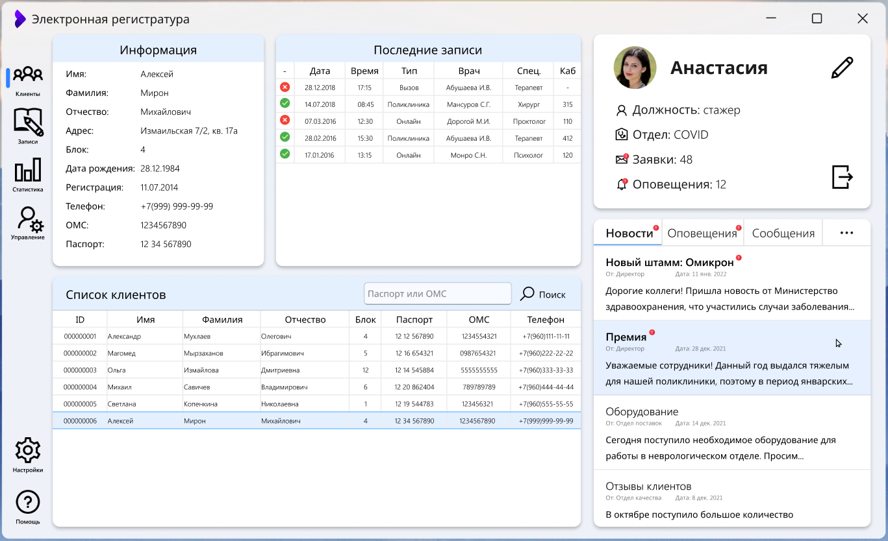
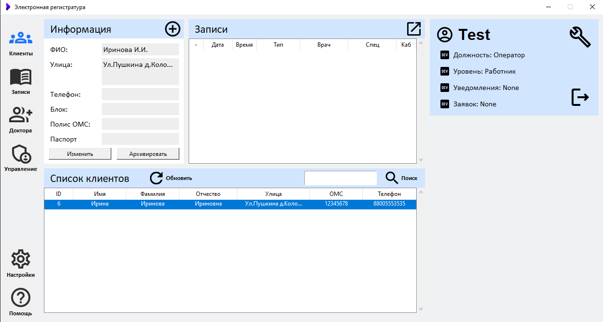

# Оконное приложение для регистратуры поликлиники 
  
## Описание проекта  
  
Hospital Registry - оконное приложение для сотрудников пользователей больницы,
где можно вести учет состояния здоровья пациента, смотреть последние новости руководства,
администрировать сотрудников и наблюдать за их действиями.  

>⚠️ Проект заброшен на стадии разработки

## Технологии
Tkinter

## Запуск проекта  
1. Запустите interface.py
2. Введите любые данные в окне входа

## Этапы разработки
Один из первых, если не самый первый мой весомый проект который я начал делать еще в колледже, 
над которым я очень долго трудился, но так и не доделал.

1. Проект в [Figma](https://www.figma.com/file/PxKG4VtSEXAFiILMc3In9G/Untitled?type=design&node-id=0-1&t=ELLvsoVNwOTo5PAu-0)
2. Реализация на Tkinter, при условии что у тебя получился неплохой макет, но ожидания разбились о функционал Tkinter
3. Реализация на PostgreSQL без знания о том как работает PostgreSQL
4. Забросить проект

PROFIT!

## Ожидание

## Реальность

